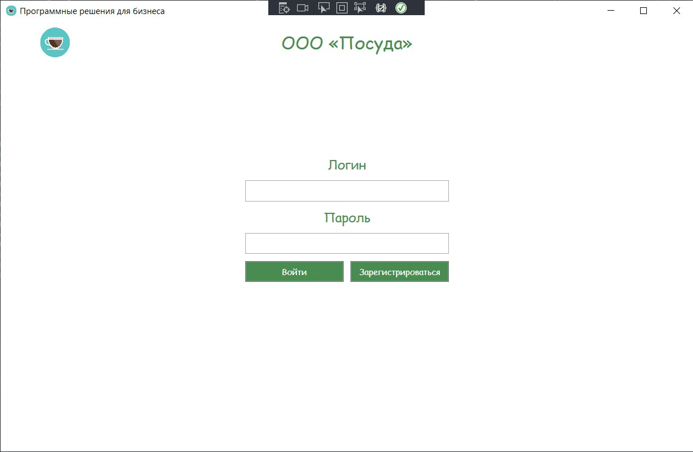

# WpfZhuma 
## ИС для ООО «Посуда»
Командная разработка на WPF с использованием ADO.NET, созданная командой из 4 человек, для подготовки к демоэкзамену.

## Структура проекта

- [задание](https://github.com/DrontHD/WpfZhuma/tree/master/%D0%B7%D0%B0%D0%B4%D0%B0%D0%BD%D0%B8%D0%B5) - ТЗ для разработки ПО
- [программа](https://github.com/DrontHD/WpfZhuma/tree/master/%D0%BF%D1%80%D0%BE%D0%B3%D1%80%D0%B0%D0%BC%D0%BC%D0%B0/WpfApp) - исходный код ПО
- [data_base.sql](https://github.com/DrontHD/WpfZhuma/blob/master/data_base.sql) - скрипт создания БД
- [ДиаграммаГанта.jfif](https://github.com/DrontHD/WpfZhuma/blob/master/%D0%94%D0%B8%D0%B0%D0%B3%D1%80%D0%B0%D0%BC%D0%BC%D0%B0%D0%93%D0%B0%D0%BD%D1%82%D0%B0.jfif) - диаграмма Ганта

## Использованные технологии

В процессе разработки программы были использованы следующие средства разработки:

- C# - язык программирования
- WPF - система для построения клиентских приложений
- ADO NET - для взаимодействия между программой и БД
- SQL Server Management Studio - СУБД
- Microsoft Visual Studio - IDE
- Git - репозиторий

## Разработчики

В таблице ниже, вы можете узнать всех тех, кто старался над программой.

| Участник | Фамилия, имя | Роль | Ответственный за |
| ------ | ------ |------ |------ |
| [DrontHD](https://github.com/DrontHD) | Ромашков Дмитрий | Project manager, developer | Поддержание командного настроя, распределение задач, разработку логики программы |
| [hekkiii](https://github.com/hekkiii) | Горданов Даниил | Developer | Разработку логики программы, обслуживание и поддержка работоспособности программы |
| [ShestakovTema](https://github.com/ShestakovTema) | Шестаков Артем | Designer, developer |  Дизайн программы, разработку диаграммы Ганта |
| [PrivetKotlet](https://github.com/PrivetKotlet) | Федоров Руслан | Database Developer | Разработку структуры базы данных, наполнение базы данных |
